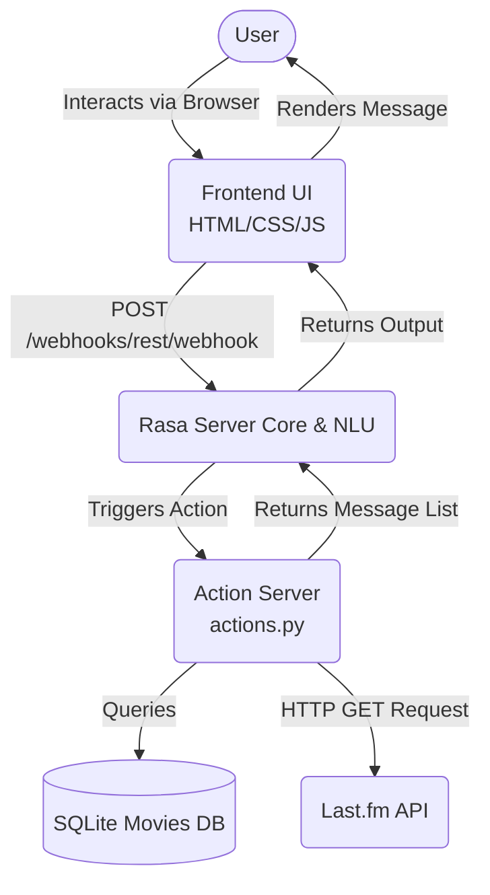

# Architecture

> Generated by /map on 2026-04-07

## Overview
The AI-Powered Music & Movies Chatbot is a conversational application built upon the Rasa framework for Natural Language Understanding (NLU) and dialogue management. It utilizes a custom Python Action Server to execute backend logic, process user intents, fetch movie descriptions from a local SQLite database, and integrate dynamically with the Last.fm API for music track details. The project features a vanilla HTML/CSS/JS frontend styled with a glassmorphic OS design to communicate with the Rasa REST webhook.

## System Diagram

## Components

### Rasa Core & NLU
- **Purpose:** Handles intent classification, entity extraction, dialogue management, and story tracking.
- **Location:** `data/`, `models/`, `domain.yml`, `config.yml`, `endpoints.yml`
- **Dependencies:** Built-in Rasa structures
- **Dependents:** Action Server, Frontend

### Custom Action Server
- **Purpose:** Executes business logic such as querying SQLite for movie recommendations, or fetching track information via external APIs based on conversational intent contexts.
- **Location:** `actions/actions.py`
- **Dependencies:** Rasa-SDK, sqlite3, requests, python-dotenv
- **Dependents:** Rasa Core

### Web Frontend
- **Purpose:** A graphical UI allowing users to have conversational interactions with the bot inside a stylish glassmorphic web page.
- **Location:** `frontend/` (`index.html`, `script.js`, `style.css`)
- **Dependencies:** None (Vanilla browser environment)
- **Dependents:** None

### Data Scripts
- **Purpose:** Utility scripts employed to format datasets for runtime, like transforming a Kaggle CSV into the local `.db` file.
- **Location:** `scripts/prepare_movies_db.py`
- **Dependencies:** pandas, sqlite3
- **Dependents:** SQLite Database

## Data Flow
1. User enters text in the web interface (`frontend/script.js`).
2. An asynchronous `POST` requests is dispatched to the Rasa REST API channel.
3. Rasa NLU identifies the user's intent and any entities (e.g. genre or movie titles).
4. Rasa dialogue policies select an appropriate action based on stories/rules.
5. If the action is an utterance, it simply responds. If it is a custom action, it calls the Action Server.
6. The Action Server runs queries against `movies.db` or fetches data from the `Last.fm` API, formats the message, and hands it back.
7. Rasa routes the final array of message outputs back to the original `POST` response.
8. The frontend renders the chat bubble in the UI.

## Integration Points
| External Service | Type | Purpose |
|------------------|------|---------|
| Last.fm API | API (HTTP GET) | Fetch top tracks, artist information, and song details or genres |
| SQLite | Database | Persistent local document store populated by kaggle CSVs storing the movies catalog |
| Rasa Server | Core REST API | The core conversation handler |

## Conventions
- **Naming:** Vanilla javascript uses camelCase; Python code (actions, scripts) uses snake_case in accordance with PEP-8.
- **Structure:** Separated strictly by Rasa framework guidelines (data for training, actions for server functions). Frontend separated entirely.
- **Runtime Fallbacks:** The action server handles database mismatches / null returns gracefully with fallback messages. Responses are dynamically altered based on previous slots set.

## Technical Debt
- [ ] Multiple leftover debug `console.log` and `console.error` statements polluting `frontend/script.js`.
- [ ] The `query_movies` function in `actions/actions.py` catches global SQLite errors safely but does not provide user-exposed granular re-attempts.
