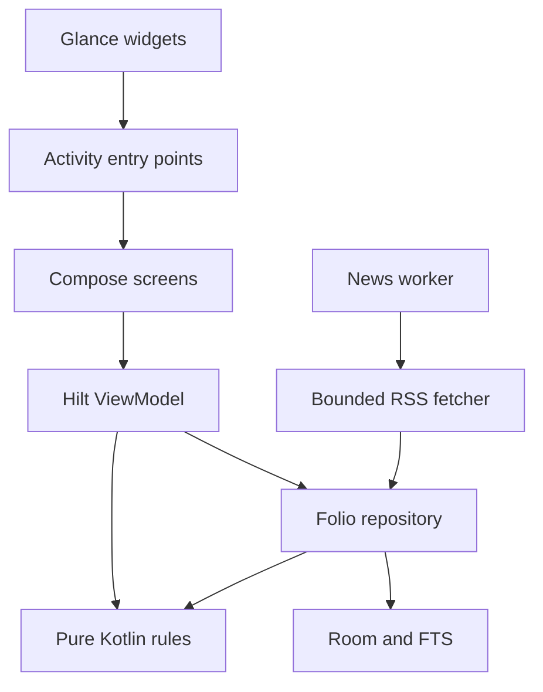

# Polymath for Android

A native, private folio for discovering ideas and turning them into useful work.

**Milestone:** 0.1.0 — the first functional Android foundation of the approved local-first architecture. This is an early development build, not the complete AI beta.

## Open and run

1. Open this directory in Android Studio with Android Gradle Plugin 8.11 support or newer.
2. Use JDK 17. Install Android SDK Platform 36 and Build Tools 35.0.0.
3. Let Gradle sync, then run the `app` configuration on Android 9 / API 28 or later.

The project includes the standard Gradle wrapper, with the Gradle 8.13 distribution checksum pinned. No API key, account, inference service, or model download is required.

```sh
./gradlew :app:assembleDebug
./gradlew :core:model:test :core:data:testDebugUnitTest :app:testDebugUnitTest :app:lintDebug
```

On Windows, use `gradlew.bat`. Android Studio writes your machine's SDK location to the ignored `local.properties` file. The debug APK is generated at `app/build/outputs/apk/debug/app-debug.apk`.

The archive retains a development-only signing key in `dev/debug.keystore` so subsequent prototype builds can update this installation. Its standard development password is intentionally public. A production release must use a separate private signing key.

## Try the main flow

1. Select some interests or choose **Explore all topics**.
2. On **Discover**, swipe right or tap **Like & save**. Tap **Undo** within five seconds to reverse the judgment.
3. Open **Vault** and search for a word from the saved card.
4. Open a knowledge pill and choose **Practice recall**. Choose an answer before revealing the explanation. Correct first recall earns 10 EXP; merely reading or saving earns none.
5. Open **Graph** to inspect topic EXP and the next available practice. A list alternative provides individual topic controls.
6. Capture a **Thought**, **Research topic**, or **Idea**. Save an idea, draft a template plan, and review and accept it.
7. Complete each dependency-ordered task with a reflection. The Desk exposes the next ready task.
8. From **Desk**, pin **One pill** or **Quick capture** to a compatible launcher. Public widget reveals do not award EXP.
9. Enable **Fetch news** to retrieve public RSS feeds. Failed refreshes retain the existing folio. Publisher dates and fetch times are distinct.

Notes have an explicit Save action in this milestone. Leaving an unsaved edit prompts before discarding it. Editing a saved note creates an immutable revision. Research and ideas expose additional goal and context fields.

## What is implemented

| Area | Behavior in 0.1 |
| --- | --- |
| Native interface | Kotlin, Compose Material 3, dark editorial cards, five destinations, readers, capture sheets, labeled gesture alternatives |
| Local persistence | Room transactions and foreign keys, immutable note revisions, unique event and earning keys, DataStore preferences |
| Discovery | Eight original, source-linked starter lessons; live RSS/Atom fetching after opt-in; finite daily deck; source diversity; mute exclusions |
| Personalization | On-device logistic ranking with topic/type features, confidence-weighted swipe updates, cold-start follow preferences, 10% exploration slots |
| Undo | Persisted reversal event, full training-event replay, five-second expiry, ownership-aware removal of swipe-created saves |
| Vault | Transactionally synchronized SQLite FTS4 over saved cards and notes; prefix keyword matching; type filters; removal from the index on deletion |
| Notes and projects | Three capture modes; revision checks; source-card links; four-phase template plans; draft acceptance; dependent tasks and reflections |
| Learning graph | Stable topic positions, related-topic edges, pan/zoom, EXP levels, accessible topic-list alternative |
| Recall | Persistent assessment episodes, answer-before-reveal, duplicate-safe awards, 1/3/7/14/30-day review schedule |
| Application EXP | 20 per qualifying task, at most 40/day, once per task; reopening reverses its award |
| Widgets | Public static recall pill with reveal and app-opening actions; three-mode quick capture; no private previews |
| Background work | Opt-in, constrained, inexact two-hour RSS refresh; bounded downloads and network timeouts |
| Privacy | Guest use, no telemetry, no private-data upload, cleartext network disabled, platform backup exclusions |

## Architecture



The initial modular monolith uses three build modules:

- `core:model`: platform-independent domain types, recommendation updates, review/EXP rules, template generation, and explicit embedding/generation interfaces.
- `core:data`: Room entities and DAO, transactional use cases, FTS indexing, RSS/Atom parsing, DataStore settings.
- `app`: Hilt composition root, ViewModel, Compose feature packages, Android share entry point, WorkManager and Glance integration.

Feature packages can be extracted into their own Gradle modules after boundaries stabilize. The initial repository is intentionally single-profile and local-only. There is no cloud schema or implicit synchronization.

## Important implementation boundaries

- **Semantic embeddings and LLM inference are not integrated.** Search currently uses FTS4. The Ask surface returns actual saved excerpts; it does not fabricate a generated answer.
- The approved next model adapters are `all-MiniLM-L6-v2` through ONNX Runtime and Qwen3-0.6B through a tested llama.cpp binding. Model licenses, tokenizer/pooling parity, signed manifests, memory, temperature, and latency gates must be verified before enabling them.
- The template planner performs no internet research. Live-web RAG, citations attached to generated claims, model downloads, and private/external evidence separation remain upcoming work.
- Starter assessments are authored examples linked to sources. They need a content review process before production expansion. Topic EXP measures credited activity, not certified expertise.
- A single topic receives each award in this build. Fractional multi-topic allocations and concept-level mastery are not implemented.
- The graph is a curated topic graph, not automatically extracted personal concept relationships.
- There is one template plan per idea at a time. Drafts can be discarded and regenerated. Active-plan regeneration, task text editing, and merge/diff review are subsequent milestones.
- RSS ingestion uses three fixed sources and stores bounded feed excerpts. It does not scrape full articles. Custom sources, conditional HTTP caching, canonical URL normalization, story clustering, and durable daily-deck snapshots are upcoming.
- A widget cannot reproduce the app's swipe gestures. Lock-screen placement varies by OS and host; the public pill is eligible, while the capture widget opts out on API 36. No cross-device compatibility claim has been made.
- Export/restore, backup recovery, automatic folder suggestions, note autosave, model-backed research, a light theme, and adaptive tablet navigation are not yet shipped. Uninstalling deletes the local folio.

## Integrity rules

Canonical data and its searchable representation change in a single Room transaction. No separate index can retain a deleted note after a successful deletion. Saves are unique by content ID. Explicit saves acquire independent ownership so undoing a prior swipe cannot remove them.

Swipe events preserve the feature vector and model version used at judgment time. Reversed events are excluded during replay; undo never subtracts an old gradient from a changed model.

Recall submissions are unique by content ID, assessment edition, and due episode. A duplicate submission returns the original result. A failed answer schedules tomorrow without an immediate EXP retry. Application awards record zero-value capped completions too, preventing reopening and completing tomorrow to evade the cap.

The app uses device-local UTC day boundaries for the daily deck and application cap. Timezone-aware learning days and clock-tampering resilience are future work; there is no competitive leaderboard.

## Verification and next implementation work

See [BUILD_STATUS.md](BUILD_STATUS.md) for the exact checks run for this handoff and [docs/IMPLEMENTATION_PLAN.md](docs/IMPLEMENTATION_PLAN.md) for the next engineering slices.

Robolectric database tests cover transaction consistency, persisted restart behavior, replay-safe undo, duplicate recall submissions, revision conflicts, dependency ordering, and EXP farming prevention. The Compose flow test uses the actual Hilt activity and repositories under Android framework simulation. It does not replace physical-device testing.

## Reference documentation

- [Android Gradle Plugin 8.11 compatibility](https://developer.android.com/build/releases/agp-8-11-0-release-notes)
- [Compose compiler setup](https://developer.android.com/develop/ui/compose/compiler)
- [Room releases](https://developer.android.com/jetpack/androidx/releases/room)
- [Glance app widgets](https://developer.android.com/develop/ui/compose/glance/create-app-widget)

Dependency versions are pinned in `gradle/libs.versions.toml`. The source archive does not include SDKs, Gradle caches, production signing credentials, user data, or model weights.

Migration note: signing keys are excluded from this Git checkout. Android generates a local debug key when no private local override exists.
