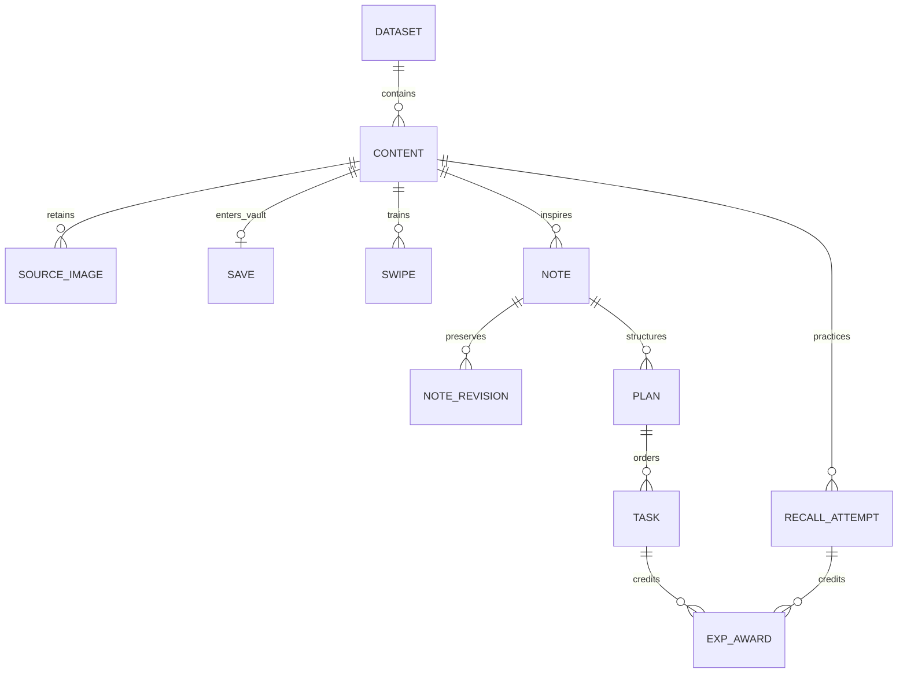
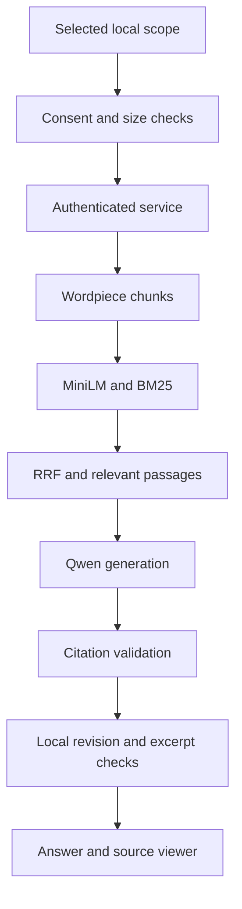

# Polymath architecture — 0.3.1 development

## Native client

Compose screens observe a Hilt ViewModel and a Room-backed repository. Room is the canonical source of personal data. DataStore holds preferences and explicit AI consent; Android Keystore protects the separate service token. Coroutines keep network and database work away from input handling.

The application remains usable offline for discovery from cached content, notes, keyword retrieval, practice, EXP and project templates. AI chat has explicit local and private-server modes. Local BM25 plus Qwen runs through a permissionless isolated native worker; the normal APK installs a separately verified model pack, and the public offline preview includes the weights. Its separate application ID avoids debug-signature collisions with existing installations. AI settings opens offline setup first; server fields require an explicit advanced action. See the [on-device architecture and build guide](ON_DEVICE_AI.md).

## Data relationships

Source-image records are JSON metadata in the content row: URL, alt text and caption. A dataset ID classifies each imported content row. Dataset import/removal uses one transaction; saved copies reference content with cascade deletion. Notes retain their own text when their source dataset is removed. Immutable EXP and swipe records preserve credited work and history. Topic preferences are independent from EXP.

Chat messages are keyed by selected scope. Citation payloads record source ID, revision and excerpt. Removing a saved source, changing/deleting a note or removing a dataset clears chat history; in-flight source changes cancel generation. Explicit clearing removes the selected conversation. No server-side document index can outlive a local deletion, because every query supplies its current corpus.

The v1 → v2 migration adds content images/dataset ID and dataset/chat tables. Original topic order is retained. A v1 training feature vector is projected into the expanded v2 feature space before replay, preserving the old six topic contributions, content-type coefficient and bias.

## Private-server RAG path

The service has one inference slot and a bounded request body/corpus. A busy service returns 429. Android cancels the underlying HTTP call when the user stops, switches scope, disconnects or edits relevant sources. Models have no tool execution authority. Source URLs are never fetched by the inference service.

Scope is a local-client privacy boundary, not a server-side multi-tenant ownership system. This service has no shared document store or user accounts. Each installation should use a dedicated trusted endpoint/key. A future shared-host product must add per-user authentication, authorization, retention policies and operational isolation before use.

## Multimedia pipeline

RSS/Atom parsing collects only image references inside the current entry, excluding feed/channel logos and other entries. Media RSS content/thumbnail, image enclosures and embedded HTML image tags are supported. JSON imports merge explicit image metadata with images in supplied HTML before text extraction. HTTPS URLs resolve against the source and deduplicate by URL.

Card faces display the first image; readers display all retained images, captions and accessible alternatives. Coil loads image pixels separately from text inference. Failed downloads show fallback text. HTTPS-to-HTTP redirects are disabled, and disk image caching is disabled. The original source metadata is carried into RAG citations; no generated image URL is accepted.

## Interfaces and performance limits

The RAG HTTP interface streams status and a final NDJSON answer after verification. It is not token streaming. The backend computes exact semantic search at request time; local Vault keyword search remains available immediately without a server. Corpus and chunk limits avoid silently dropping source tails. Very large vaults must use smaller imported dataset scopes until incremental local semantic indexing is implemented.

There are no measured phone latency/thermal guarantees yet. The real CPU model smoke receipt is an integration check, not a broad performance benchmark. See the roadmap for on-device embeddings, physical-device qualification and corpus scaling.
