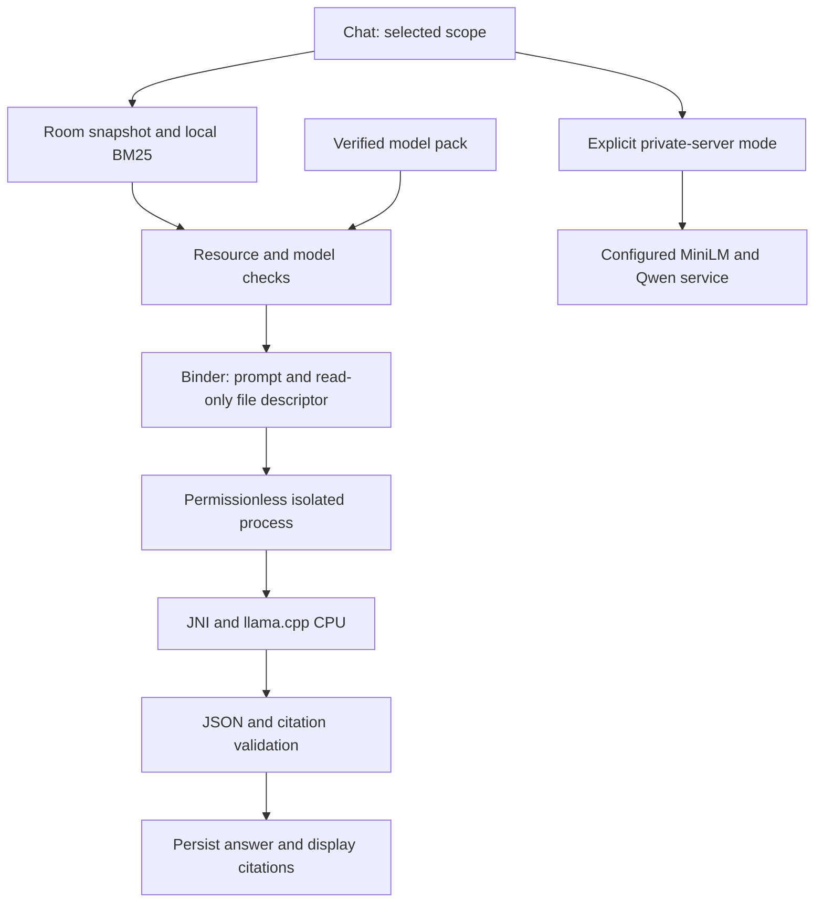

# Polymath: on-device LLM architecture and integration guide

**Decision date:** 9 September 2026. **Implementation:** Android 0.3.0 development.

## 1. Recommendation and scope

Use **Qwen3-0.6B, Q4_K_M GGUF, with a pinned llama.cpp CPU runtime** for the first on-device implementation. Install the model once through an explicit download, import the approved file, or include it in a specially built APK. After installation, local chat and retrieval require no network connection or API key.

Qwen is compatible with llama.cpp: Qwen's own documentation identifies Qwen3 support, and llama.cpp provides an Android integration. Compatibility is established; acceptable performance on a particular phone must still be measured. Selecting a larger Google model simply because a small Qwen model is slow would not establish a performance improvement. [Qwen runtime documentation](https://qwen.readthedocs.io/en/latest/run_locally/llama.cpp.html), [llama.cpp Android documentation](https://github.com/ggml-org/llama.cpp/blob/b10834/docs/android.md).

The implementation adds local generation and **lexical RAG using BM25**. It does not yet add an on-device embedding model or claim semantic retrieval parity with the existing MiniLM service. Generated answers are grounded in selected saved/imported text; there is no live browsing, image understanding, tool execution, or automatic project execution in the local worker.

## 2. Runtime and model evaluation

| Candidate | Android feasibility | Engineering trade-off | Decision |
|---|---|---|---|
| Qwen3-0.6B + llama.cpp | GGUF inference through NDK/JNI; ARM64 CPU and x86_64 test builds | Small model, direct control of context and memory, no GPU driver requirement; application owns native lifecycle and cancellation | Implemented baseline |
| Qwen + MLC LLM | Compiles supported models and runtime for Android; optional bundled weights | TVM/Rust/model compilation adds toolchain work; accelerated device testing is essential | Candidate if CPU measurements fail and target GPU families are known |
| Qwen/Gemma + LiteRT-LM | Current Kotlin API and CPU/GPU/NPU backends; requires compatible converted model artifacts | Good Android integration surface; a GGUF cannot be passed directly to a `.litertlm` loader | Preferred engine to evaluate for a Google-model pivot |
| MediaPipe LLM Inference | Existing Android API; documented Gemma support | Google marks it maintenance-only and directs new work to LiteRT-LM | Do not start a new integration on this API |
| Generic TensorFlow Lite/LiteRT interpreter | Operator execution is only part of generation | Tokenization, attention/cache management, decoding and supported model conversion are still required | Use a complete LLM runtime, not just an interpreter |

MLC documents Android packaging, model-library compilation and model-weight bundling. Its demo is hardware-specific and its documentation warns against relying on emulator GPU execution. LiteRT-LM documents the Kotlin engine, model initialization and resource cleanup. Family-level support does not establish that an arbitrary checkpoint/quantization is compatible. [MLC Android SDK](https://llm.mlc.ai/docs/deploy/android.html), [LiteRT-LM Android](https://developers.google.com/edge/litert-lm/android), [MediaPipe maintenance notice](https://developers.google.com/edge/mediapipe/solutions/genai/llm_inference/android).

### Qwen versus Gemma

| Model | Architecture and footprint implications | Role |
|---|---|---|
| Qwen3-0.6B | Small dense text model with grouped-query attention; Apache-2.0 | First local source-Q&A engine; insufficient for dependable general-purpose expert reasoning |
| Qwen3-0.6B Q8_0 | Same architecture, larger weight pack and less aggressive quantization | Quality comparison/control before blaming the architecture for Q4 errors |
| Gemma 3 1B IT | Small text model; model access and redistribution use Gemma-specific terms | Technically viable fallback experiment if those terms are accepted; not an Apache-2.0 equivalent |
| Gemma 4 E2B IT + LiteRT-LM | Mobile-oriented model; 2.3B effective parameters but 5.1B including embeddings, plus modality components | Candidate for stronger devices if Qwen fails quality or measured latency gates; not a smaller drop-in model |

Qwen's model card and the selected quantization declare Apache-2.0. Gemma licensing is version-specific: Gemma 3 uses the published Gemma terms, while the Gemma 4 E2B model card declares Apache-2.0. Confirm the exact artifact's license and notices before redistribution. Do not treat “open weights” as a universal license. [Qwen3-0.6B](https://huggingface.co/Qwen/Qwen3-0.6B), [selected Q4 conversion](https://huggingface.co/unsloth/Qwen3-0.6B-GGUF/blob/50968a4468ef4233ed78cd7c3de230dd1d61a56b/Qwen3-0.6B-Q4_K_M.gguf), [Gemma 3 1B](https://huggingface.co/google/gemma-3-1b-it), [Gemma terms](https://ai.google.dev/gemma/terms), [Gemma 4 E2B](https://huggingface.co/google/gemma-4-E2B-it).

### Conditional fallback policy

1. Establish a baseline on the actual supported phones using the same evidence corpus, prompts, output budget and scoring criteria.
2. If Q4 quality is materially below Q8, compare Q5/Q8 before changing model families; these alternatives are evaluation work, not selectable packs in this build.
3. If Qwen fails latency, thermal or stability gates, benchmark LiteRT-LM with an approved Gemma artifact on those same phones. Evaluate CPU and GPU separately; do not assume an NPU is available.
4. Adopt Gemma only if the new artifact passes quality, memory, privacy and lifecycle gates. Add a separate immutable model manifest, prompt adapter and runtime adapter; `.gguf` and `.litertlm` are not interchangeable.
5. If neither passes on a device tier, disable local generation for that tier while retaining reading, notes and explicitly configured server mode. Never upload a local question automatically when local inference fails.

The fallback is an engineering decision after measurements. There is no silent model download, license acceptance or network fallback in the app.

## 3. Implemented system architecture



### Module boundaries

| Component | Responsibility |
|---|---|
| `:core:local` | Model installation, resource checks, service connection, native inference and IPC |
| `ModelPackStore` | Approved model URL/import, bounded download, hash check, atomic promotion, removal and verified read-only descriptor |
| `LocalInference` | One active request, Binder lifecycle, timeout, thermal cancellation, unbind on completion/cancellation |
| `LocalLlmService` | Dedicated `isolatedProcess=true`, non-exported service with one worker thread |
| `LocalProcessFactory` | Starts a plain Application in the isolated process, avoiding Hilt/Room/news/image initialization |
| `LocalRag` in `:core:data` | BM25 chunks, source selection, prompt construction and validated citations |
| `FolioViewModel` and chat UI | Explicit device/server choice, installation progress, stop/retry, source-change cancellation |

An Android isolated service runs without the app's permissions. This implementation additionally checks that the worker is isolated and has no INTERNET permission. It receives only a bounded prompt and a read-only descriptor; it cannot open the app's Room database. Native crashes terminate that worker rather than directly crashing the UI process. System-wide memory pressure can still affect the foreground app, so process isolation is not a substitute for memory limits. [Android service isolation](https://developer.android.com/guide/topics/manifest/service-element#isolated).

### Request lifecycle and privacy

1. Read an immutable snapshot of **My vault** or the selected dataset. Reject scopes larger than 150 documents/300,000 characters or a document larger than 20,000 characters.
2. Split text into 640-code-point passages with a 480-code-point stride; compute BM25 scores for the question. Select up to three non-overlapping passages. A zero-match query returns an evidence limitation without invoking the model.
3. Include at most two short previous questions as context. Previous model answers are not evidence. Neutralize ChatML role delimiters embedded in source text; treat the remaining text as untrusted data.
4. Check device resources, verify the model file, bind the isolated service and transfer the descriptor and prompt. JNI duplicates the descriptor, wraps it with `fdopen`, and calls the pinned runtime's `llama_model_load_from_file_ptr`; it never reopens an app-private path from the isolated UID.
5. Tokenize with the actual Qwen tokenizer. Reject prompts over 1,536 tokens rather than silently truncating evidence. Generate up to 256 tokens in a 2,048-token context, with thinking disabled by the Qwen prompt template.
6. Apply a JSON grammar for `answer` and `citation_ids`. After generation, validate JSON, IDs and original source revisions/offsets; reconstruct citation titles, URLs and images from the local corpus. Invalid/incomplete output produces an evidence-check response.
7. Persist the validated answer. Unbind and terminate the disposable inference process, releasing weights, KV cache and native scratch memory. Stop, app-backgrounding, thermal cancellation and timeout follow the same cleanup path.

Citation validation establishes source identity and excerpt integrity, not factual entailment. A small model may still produce a wrong claim with a valid citation. Prompt isolation and lack of tools contain consequences; they do not eliminate prompt injection or hallucination.

Local chat does not load citation images automatically, since those would contact source hosts. User-opened original links and the separate live-news/feed features may use the internet. Model downloads send a standard file request to Hugging Face/CDN hosts, without notes, questions or source text. No telemetry or remote fallback was added.

## 4. Quantization and memory budgets

The shipped model lock is [local-model-lock.json](local-model-lock.json). The Q4 pack is an **Unsloth conversion of Qwen**, not an official Qwen-published Q4 artifact. It is pinned by repository revision, exact byte length and SHA-256. The official Qwen GGUF repository publishes a Q8_0 comparison artifact. [Official Qwen GGUF repository](https://huggingface.co/Qwen/Qwen3-0.6B-GGUF).

| Parameter | Implemented value |
|---|---|
| Weight quantization | Q4_K_M, mixed K-quant representation; not exactly four bits for every tensor |
| Model file | 396,705,472 bytes; approximately 397 MB / 378.3 MiB |
| Weight loading | Memory mapped, no `mlock`, no Java heap copy of the model |
| Context / prompt / output | 2,048 / 1,536 / 256 tokens |
| KV cache | F16 keys and values |
| Logical / physical prompt batches | 128 / 64 tokens |
| Decoder / prefill threads | Two maximum, background thread priority |
| Concurrency | One inference request; one model per disposable worker |
| Native / client time limits | 120 / 125 seconds |
| GPU, NPU, speculative decoding | Disabled in the baseline |

For this Qwen architecture, the ordinary F16 KV payload is:

`2 × layers × context_tokens × KV_heads × head_dimension × bytes_per_value`

Using 28 layers, eight KV heads and head dimension 128, a 2,048-token context uses approximately **224 MiB** for K/V payload alone. It is approximately 112 MiB at 1,024 tokens and 448 MiB at 4,096 tokens. Quantizing the weights does not also quantize the cache. These are calculations from model configuration, not measured process memory. [Qwen configuration](https://huggingface.co/Qwen/Qwen3-0.6B/blob/main/config.json).

Budget **roughly 0.8–1.2 GiB** for the worker as an initial planning estimate, including resident weights, KV, compute buffers and runtime overhead. Actual peak RSS/PSS depends on device, compiler, cache allocation, mapped-page residency and workload; record it before widening eligibility. Memory mapping avoids eagerly copying the entire file but does not make resident model pages free.

Preflight requires a supported 64-bit ABI, at least 3.5 GiB reported total RAM (roughly the nominal 4 GB device tier), no low-RAM/low-memory flag, and available memory above **1.5 GiB plus Android's low-memory threshold**. It also blocks severe thermal status and battery below 15% while unplugged. These conservative eligibility rules are not a guarantee against the low-memory killer. ARM64 is the phone target; x86_64 is included for emulator integration testing. 32-bit APK stubs preserve non-local features on older devices.

F16 KV is retained initially because cache quantization introduces another quality/backend variable. A measured Q8 cache or smaller context is a later optimization. Two CPU threads and no GPU offload favor predictable portability; the fastest engine must be determined by benchmarks, not assumed from a backend name.

## 5. Model distribution and storage

| Distribution | Offline after installation | Practical cost |
|---|---|---|
| Default small APK plus explicit model download | Yes | One 397 MB download; restart after cancellation/interruption |
| Import approved GGUF through Android document picker | Yes | User transfers the exact approved pack; unknown models rejected |
| APK including `assets/models/<approved GGUF>` | Yes, including first-run installation | Approximately 397 MB added to APK; model is copied to private storage for the descriptor/mmap path |

Use the download/import option for ordinary testing. The optional bundled APK intentionally supports installations with no first-run internet access. Bundling is not a way to evade distribution-channel size limits; confirm the current channel's rules before store delivery and consider an install-time asset pack for a later Play distribution.

All installations write to a partial file, enforce the expected maximum size, stream SHA-256, sync the file and atomically rename it only after validation. A failed installation preserves the prior model. Cancellation holds the install mutex until the network reader has closed. Stored weights are in `noBackupFilesDir/models`; no model or signing key enters Git. Loading verifies the file again before handing it to the worker.

Allow roughly 460 MB free space for a normal model installation, plus existing app data and the APK. A bundled APK also retains its packaged copy, so model-related disk use approaches two copies. Updates may temporarily require another pack. Removing the model preserves notes, cards and chat history. Resume-by-HTTP-range, model deltas and encrypted model storage are not implemented; encrypting a public weight file would not protect the private notes and would interfere with direct mapping.

## 6. Step-by-step Android integration and build

### Step 1 — Prepare the workstation

Use Git, Python 3.10+, JDK 17 and Android Studio. Python here prepares artifacts; it is not embedded in the Android app. On Windows, use PowerShell and `gradlew.bat`. Use the same JDK for Android Studio's Gradle setting and terminal builds.

In **Tools → SDK Manager → SDK Tools → Show Package Details**, install these pinned packages:

| Tool | Version |
|---|---|
| Android SDK platform | 36 |
| SDK Build Tools | 35.0.0 |
| NDK, side by side | 28.2.13676358 |
| CMake | 3.22.1 |
| Gradle wrapper / AGP | 8.13 / 8.11.1 |
| Kotlin | 2.1.21 |

The project's `ndkVersion` and `externalNativeBuild.cmake.version` select these versions. `sdkmanager` can install the same packages after reviewing the Android SDK licenses. [Official NDK/CMake installation guide](https://developer.android.com/studio/projects/install-ndk).

```bash
sdkmanager "platform-tools" "platforms;android-36" "build-tools;35.0.0" "ndk;28.2.13676358" "cmake;3.22.1"
```

### Step 2 — Check out and prepare the native source

```bash
git clone https://github.com/Bhargav2301/polymath_ai_news_chat.git
cd polymath_ai_news_chat
python scripts/prepare_local_llm.py
```

The script creates an ignored native checkout and verifies commit `992cb503cdacf691ef06c332d05243bc7807257b` (llama.cpp `b10834`). It rejects a changed or different existing checkout. CMake consumes that source; it does not fetch a floating branch during compilation. Internet is needed to prepare dependencies initially; after caching them, the build can be tested with Gradle's `--offline` option.

### Step 3 — Build the normal APK

Open the `android/` directory in Android Studio, allow Gradle sync, and build `app`. From a terminal:

```bash
cd android
bash gradlew :app:assembleDebug --max-workers=2
```

On Windows, run `./gradlew.bat :app:assembleDebug --max-workers=2`. Output: `android/app/build/outputs/apk/debug/app-debug.apk` relative to the repository root.

The `:core:local` module compiles C++17 and packages `libpolymath_llm.so`. llama.cpp and its CPU dependencies link statically into that library; C++ uses `c++_static`. GPU drivers, network-serving binaries and model weights are absent from the normal APK. JNI entry points are kept through consumer ProGuard rules. Tensor kernels use `-O3` in debug and release builds so testing APKs do not run unoptimized matrix operations.

### Step 4 — Install and configure local mode

```bash
adb install -r app/build/outputs/apk/debug/app-debug.apk
```

In Polymath, open **Desk → chat icon → Connection → On device**. Choose **Download Qwen** or **Import approved GGUF file**. Wait for verification, then add the example dataset and ask about the voltage in its circuit. Test again with airplane mode enabled. An empty scope should explain that it lacks evidence.

Different development signing keys prevent an in-place upgrade. Do not uninstall an older build containing important notes without preserving that data; export/restore is still pending. The existing public 0.2 test release is a separate build and does not contain this local engine.

### Step 5 — Optional APK with bundled weights

From the repository root:

```bash
python scripts/prepare_local_llm.py --bundle-assets /absolute/path/polymath-model-assets
cd android
bash gradlew :app:assembleDebug -PpolymathModelAssets=/absolute/path/polymath-model-assets --max-workers=2
```

Windows example:

```powershell
python scripts/prepare_local_llm.py --bundle-assets C:/Polymath/model-assets
cd android
./gradlew.bat :app:assembleDebug -PpolymathModelAssets=C:/Polymath/model-assets --max-workers=2
```

The supplied directory must contain `models/Qwen3-0.6B-Q4_K_M.gguf`. Gradle sets `noCompress` for GGUF files. In this APK, the local settings show **Install included model**, which copies and verifies the pack without network access. This is a genuine bundled-model path, not a link to an inference server.

### Step 6 — Run automated checks

```bash
bash gradlew :core:model:test :core:data:testDebugUnitTest :core:local:testDebugUnitTest :app:testDebugUnitTest :app:lintDebug :app:assembleDebug --max-workers=2
cd ..
python scripts/validate_project.py
```

The [local-inference workflow](../.github/workflows/local-inference.yml) builds the same C++ inference core on a host, runs the actual Q4 model with the response grammar, and runs Android instrumentation with the exact model in airplane mode. Unit fixtures cover hash rejection, cancellation, source retrieval, Unicode citation offsets, malformed model output and source-delimiter injection.

Native binaries must support 16 KB pages. This build uses NDK r28 and explicit 16 KB linker alignment; AGP 8.11.1 handles packaging alignment. Validate **all** packaged native libraries and run a 16 KB emulator/device test before store release. Build settings alone do not certify runtime compatibility. [Android 16 KB guidance](https://developer.android.com/guide/practices/page-sizes).

## 7. Acceptance gates and implementation roadmap

These are proposed release gates, not reported benchmark results.

| Gate | Method | Initial acceptance target |
|---|---|---|
| Offline privacy | Airplane-mode test; packet capture with normal network enabled; inspect worker permissions | No inference/question/evidence network request in local mode |
| Grounded quality | At least 100 human-reviewed questions across existing domains, including missing/hostile evidence; compare Q4 with Q8 | At least 90% supported answers on answerable cases; at least 95% correct abstentions on intentionally missing evidence |
| Retrieval | Human relevance labels and Recall@3; include paraphrases and multilingual examples | Report failure classes explicitly; do not call lexical matching semantic search |
| Responsiveness | Macrobenchmark/Perfetto while scrolling and generating on 4/6/8 GB phones | No ANR; no persistent UI frame regression; evaluate lower-tier opt-out |
| Latency | Cold first-token and full short-answer timing over 30 runs per device | p95 first token under 15 seconds; p95 128-token answer under 60 seconds |
| Memory | `dumpsys meminfo`, native profiling and low-memory stress | Worker peak PSS within the validated tier budget; no foreground-app data loss |
| Thermal/battery | Repeat ten source-Q&A requests; include unplugged device | Stop at severe thermal status; no runaway background inference; publish measured battery cost |
| Lifecycle | Stop, background, rotation, source edit, worker death and interrupted installation | One worker maximum; no stale answer persistence; model/notes remain consistent |
| Platform | Android 9, 15 and 16; ARM64 hardware; x86_64 and 16 KB integration environments | Successful install, load, inference, cancellation and native alignment checks |

Recommended next engineering slices:

1. **Device qualification:** run the matrix above, record build/model hashes and publish device eligibility results. Retain experimental status until this gate passes.
2. **Local semantic retrieval:** add a compact embedding model and incremental index, evaluate it separately, then combine BM25 and vectors. Do not allocate embedding and generation models simultaneously without measuring peak memory.
3. **Measured optimizations:** compare Q5/Q8, smaller contexts, bounded warm-worker reuse and accelerated runtimes. A warm worker must unload on idle/background/memory pressure; the current implementation frees it after every request.
4. **Gemma pivot if needed:** implement a separate LiteRT-LM adapter and approved pack after the same evaluation gates. Require explicit user model selection and complete removal of unused packs.
5. **Distribution hardening:** production signing, 16 KB runtime qualification, download resumption, model-update rollback, export/restore and optional store asset delivery.

The engineering distinction is deliberate: functional on-device generation can be verified in CI; a smooth experience across Android phones requires physical-device evidence.
